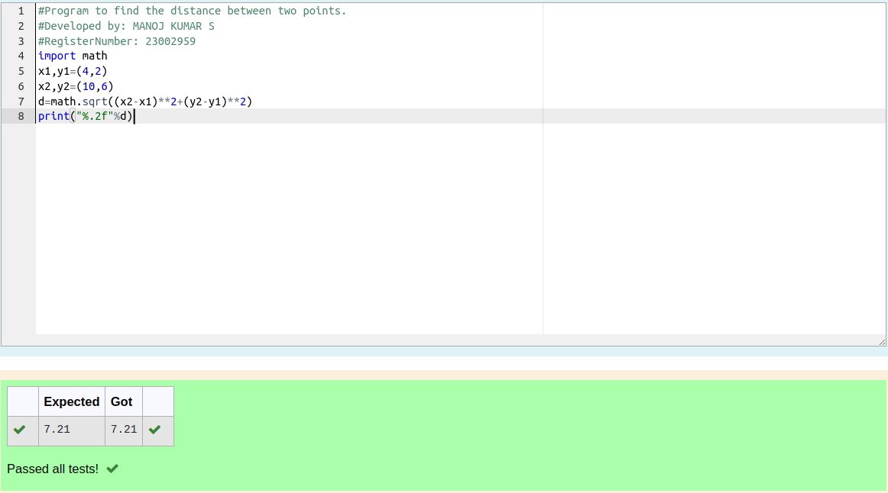

# DISTANCE-BETWEEN-TWO-POINTS

## AIM:
To write a python program to find the distance two 2 points
## ALGORITHM:
### Step 1: 
Import the math function
### Step 2:
 Mark two lists which consist of two variables and initialize them
### Step 3: 
Substitute the values in the distance formula  
### Step 4: 
Do this is sqrt fumction
### Step 5: 
Print the value
### PROGRAM:
```
#Program to find the distance between two points.
#Developed by: MANOJ KUMAR S
#RegisterNumber: 23002959
import math
x1,y1=(4,2)
x2,y2=(10,6)
d=math.sqrt((x2-x1)**2+(y2-y1)**2)
print("%.2f"%d)

```  


### OUTPUT:



### RESULT:
Thus the two distance between two points are calculated
